# What's a Book? - Online Library

## Introduction

This project is a web application in the context of the SAE course at the IUT of Blaganc. This wesite is a library management system. This repository contains the whole code of the project, including the `Php Symfony API`, the `EasyAdmin Back Office`, the `Angular Frontend` and the `MariaDB Database`.

**The goal of this project is mainly just to be a demo and display technical features. It is not meant to be put in production.**

You can find the specifications in the [specifications](documentation/Projet_SF6_2023-24%20v2.md) file.

## Table of contents

- [What's a Book? - Online Library](#whats-a-book---online-library)
  - [Introduction](#introduction)
  - [Table of contents](#table-of-contents)
  - [Documentation](#documentation)
  - [Technologies](#technologies)
  - - [Backend](#backend-1)
  - - [Frontend](#frontend-1)
  - - [Database](#database-1)
  - [Frontend](#frontend)
  - [Database](#database)
  - [API](#api)
  - [Back Office](#back-office)
  - [Crontab](#crontab)
  - [Installation](#installation)
  - - [Dockers](#dockers)
  - - [Manual](#manual)
  - [Authors](#authors)

## Documentation

### User Case

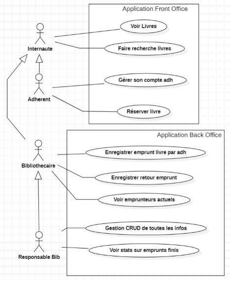

### Original UML

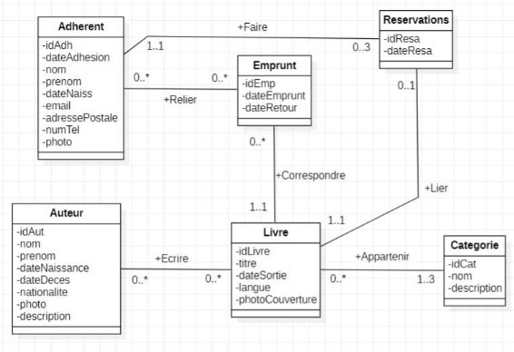

## Technologies

### Backend

| Technology       | Version |
| ---------------- | ------- |
| PHP              | 8.1.2   |
| Symfony          | 5.8.4   |
| Composer         | 2.6.6   |
| EasyAdmin        | 4.0.0   |
| Nelmio (Swagger) | 4.19.3  |

### Frontend

| Technology | Version |
| ---------- | ------- |
| Node       | 21.6.1  |
| npm        | 10.2.4  |
| Angular    | 16.2.0  |
| Tailwind   | 3.4.1   |
| TypeScript | 5.3.3   |

### Database

| Technology | Version |
| ---------- | ------- |
| MariaDB    | 11.4.0  |

## Frontend

The frontend is an Angular application. It serves as the main interface for the users and members of the library. It allows to present the fictional library place, Instagram, How to become a member ...
Also, the main goal of it is to allow the users to search for books, see the details of a book, and to reserve a book in order to borrow it later. It comes with a login and register system, and a user profile page.
There is of course a support page and also a "suggest a book" feature.

#### Illustrations

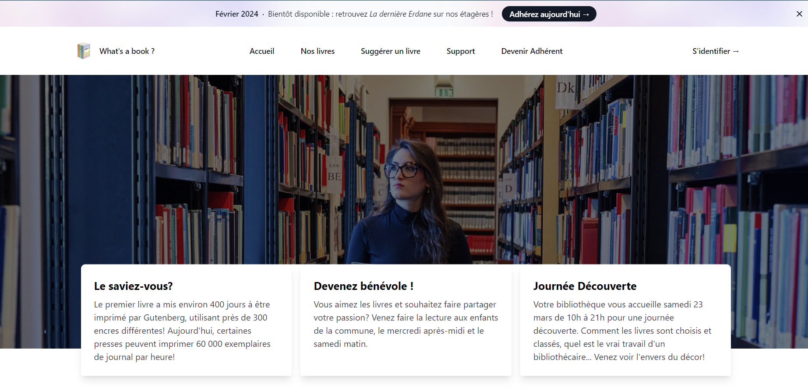

> The main page of the frontend

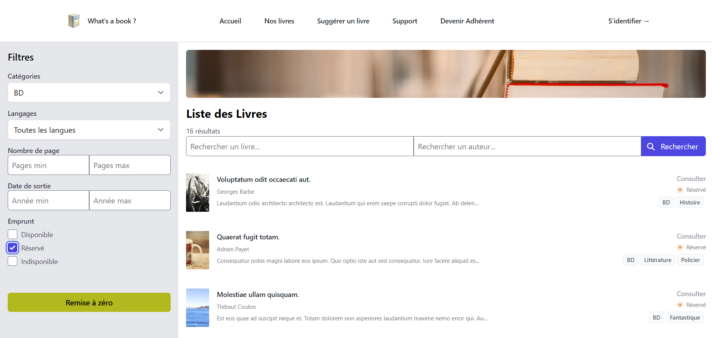

> The search page of the frontend

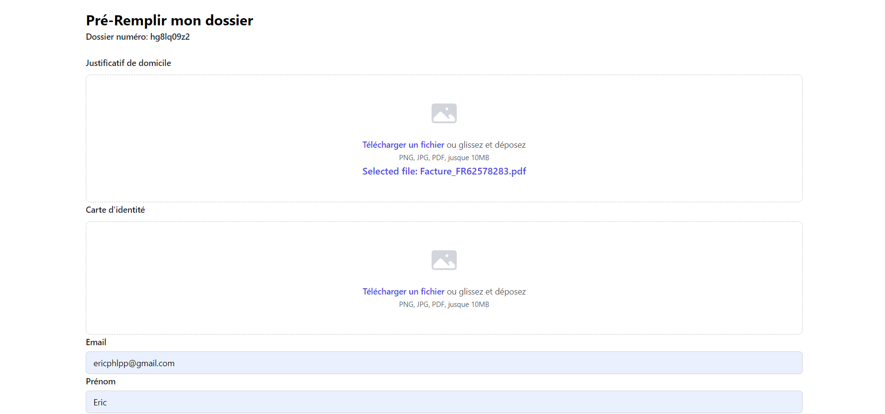

> The member application page of the frontend

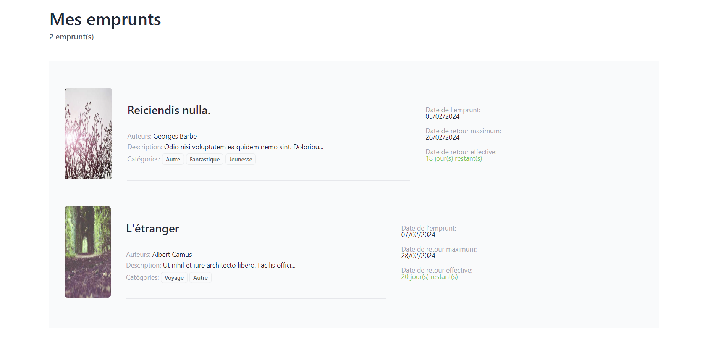

> The loans page of the frontend

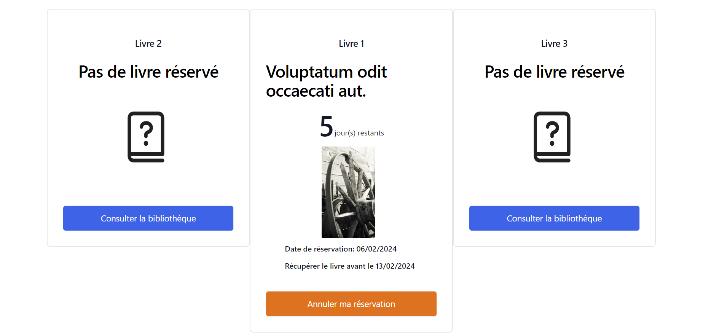

> The reservation page of the frontend

## Database

The whole Database is in MariaDB, but mainly managed by the Symfony ORM.
The only migration available is the one to create the database and the tables. See the `Installation` section for more information.
The database can be filled with fixtures, see the `Installation` section for more information.

The database is a 3NF database, with 5 tables.

### MCD (Model Conceptual Diagram) of the database

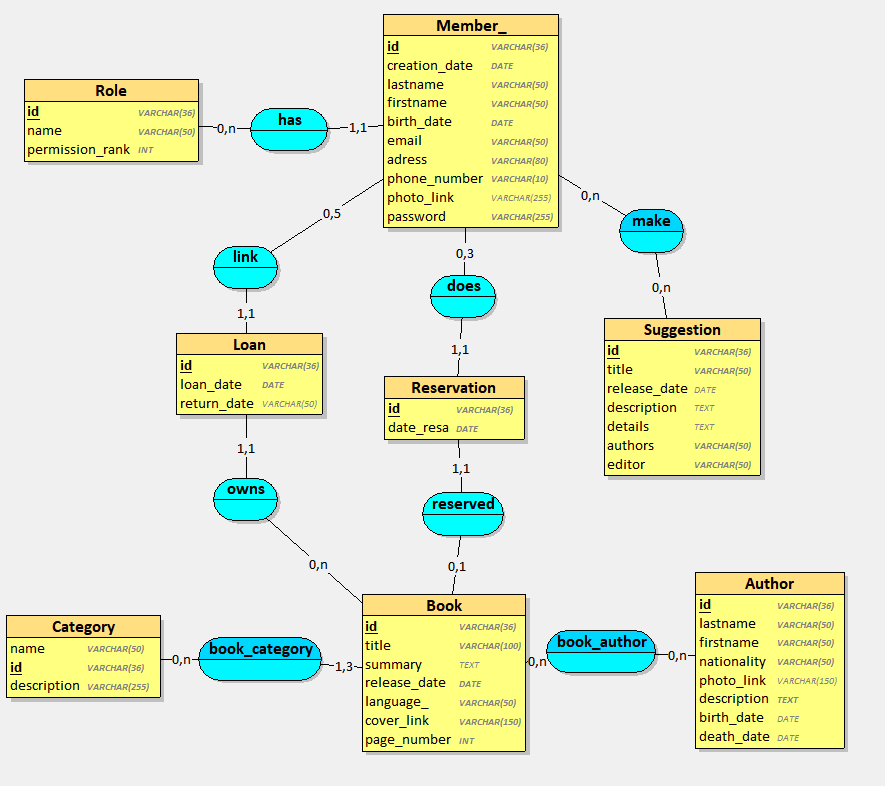

> You can find the script to create manually the database in the `database/scripts/` folder.

## API

The API is a PHP Symfony application. It serves as the main interface for the frontend and the back office. It allows to manage the database, to create, read, update and delete data from the database. It also allows to authenticate users and to manage the user's profile. The routes are protected by a JWT token system. Every JWT key (private and public) are available in the `config/jwt/` folder, because this project isn't made to be put in production.

The API is documented with Swagger, and the documentation is available at the `/api/doc` route.

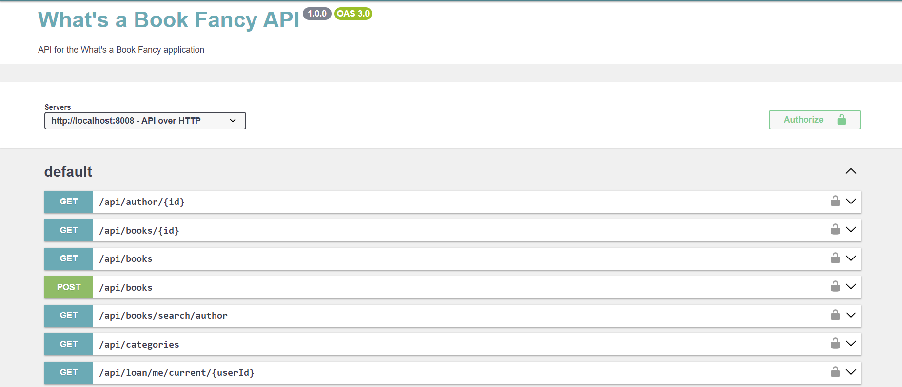

I've also use `Postman` to test the API, and the collection is available in the `server/doc/` folder.

## Back Office

The back office is an EasyAdmin application. It serves as the main interface for the library's staff. It allows to manage the database in an user-friendly way. It also allows to manage the users, the books, the authors, the categories, the loans, the reservations, the members, the suggestions, the supports, the Instagram posts, and the member applications.

Everything has been customized to fit the library's needs.

### Illustrations

#### Welcome Page

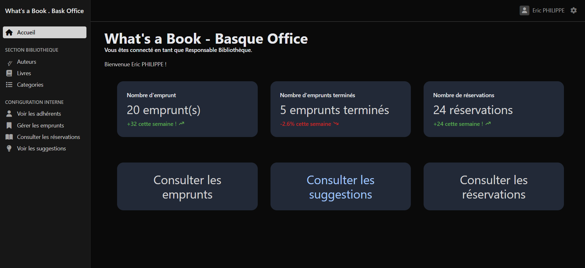

#### Loans Page

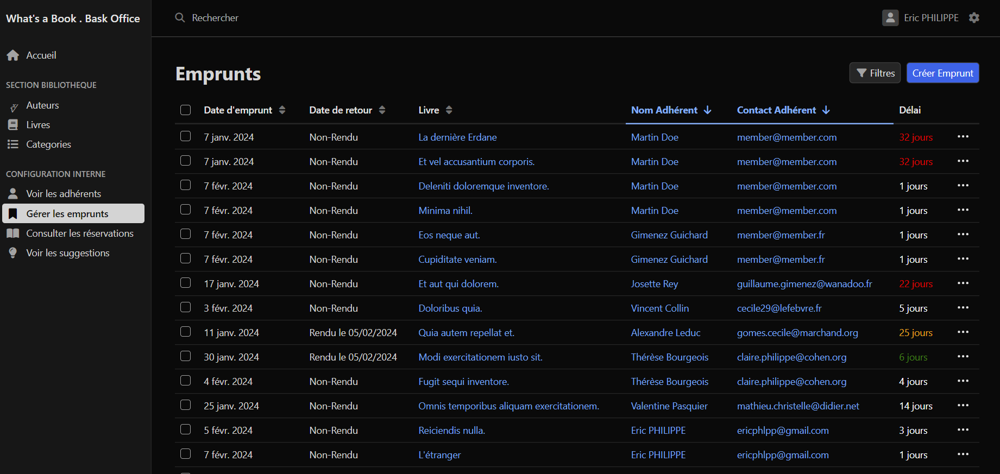

#### Confirmation Mail

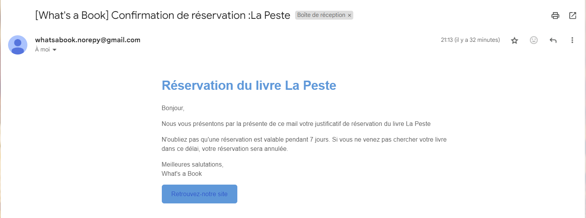

## Crontab

The application uses a crontab to erase automatically the reservations that are older than 7 days. The crontab is set to run every day at 00:00. Everything is made with `NodeJs` and `JavaScript`. It's only a simple script that uses that connects to the database and deletes the reservations that are older than 7 days, sending an email to the user to inform him that his reservation has been deleted.

The script can be found in the `services/` folder. And the crontab configuration file at the root of the project.

## Installation

There is a `CLI.sh` file at the root of the project that allows you to run different commands to install the project. You can use it with the following commands:

| Description                                      |
| ------------------------------------------------ |
| Installer toutes les dépendances                 |
| Lancez le serveur Symfony                        |
| Lancez le serveur Angular                        |
| Lancez le script de suppression des réservations |
| Créer la base de données                         |
| Migrer la base de données et la remplir          |

> Please don't forget to give the `CLI.sh` file the right permissions to be executed.

```bash
> chmod +x CLI.sh
```

### Dockers

You can use the `docker-compose.yml` file to run the whole project with `Docker`. You can find the `Dockerfile` and the `docker-compose.yml` in the `server/` folder.

### Manual

#### Backend & Databse Instructions

**.0 Prerequisites**

- Having a MariaDB server running

**.1 Databse Creation with Php**

```bash
# Go to the server folder
> cd server

# Install the dependencies
> composer install

# Create the database
> php bin/console doctrine:database:create

# Create the tables
> php bin/console doctrine:migrations:migrate

# Load the fixtures
> php bin/console doctrine:fixtures:load
```

**.2 Backend Setup with Php**

```bash
# Go to the server folder
> cd server

# Install the dependencies
> composer install

# Start the server
> symfony server:start --port=8008
```

#### Frontend Instructions

**.0 Prerequisites**

- Having NodeJs installed

**.1 Frontend Setup with Angular**

```bash
# Go to the frontend folder
> cd frontend

# Install the dependencies
> npm install

# Start the server
> ng serve

# Or build the project, it will automatically place the files in the server/public folder
> ng build
```

#### Crontab Services Instructions

**.0 Prerequisites**

- Having NodeJs installed

**.1 Crontab Setup**

```bash
# Go to the services folder
> cd services

# Install the dependencies
> npm install

# Start the script
> node index.js

# Or use the crontab file
> crontab crontab
```

## Authors

- Éric PHILIPPE
