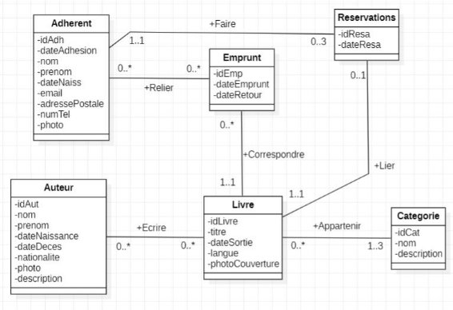

# **Projet SAE S6 : Gestion de Bibliothèque !**

Le but de ce projet est de réaliser une application web de « Gestion de Bibliothèque » avec les outils logiciels utilisés lors du POC.

Voici une vision globale du travail à réaliser :

- Un Back-office (avec Symfony et EasyAdmin) permettant l’ajout, la modification, la suppression d’auteurs, de livres et de catégories de livres (romans français, romans étrangers, essais politiques, essais économiques, etc.…) ainsi que la Gestion des adhérents et de leurs emprunts.
- Une API REST (avec Symfony) qui fournira des informations (ou services) sur les livres, auteurs, emprunts et adhérents.
- Un Front-Office (avec Angular) qui permettra la recherche de livres, la** réservation** de livres et la gestion de compte adhérent.

Diagramme de Classes (minimal)

Vous vous baserez sur ce diagramme de classes pour créer vos entités. Vous choisirez les détails d’implémentation (type d’attribut, valeur par défaut, etc.)\*\* selon ce qui vous paraît le plus cohérent pour le projet. Vous prévoyerez également des fixtures pour « peupler » suffisamment votre base de données.

Diagramme (minimal) des Cas d’Utilisation

## Détails des Cas d’Utilisation

- Internaute (au travers de l’application Front-office) :
- peut voir les livres de la bibliothèque
- peut faire des recherches de livres
- Adhérent (au travers de l’application Front-office) :
  - peut voir les livres de la bibliothèque
  - peut faire des recherches de livres
  - peut gérer son compte adhérent (voir infos, modif certains infos : email, telephone…)
  - peut réserver un livre (pour un emprunt dans un futur proche)\*\*
  - règles (minimales) de gestion des réservations :\*\*
    - 3 réservations maximum\*\*
    - on peut librement annuler une résa\*\*
    - une résa qui devient un emprunt disparait\*\*
    - une resa qui a plus de 7j disparait\*\*
    - on ne peut pas réserver un livre qui est déjà réservé\*\*
    - on ne peut pas réserver un livre qui est déjà emprunté\*\*
- Bibliothécaire (au travers du Bask-office):
  - peut gérer les emprunts de livres par les adhérents
  - peut gérer les retours d’emprunts
  - peut voir la liste des utilisateurs ayant des livres empruntés (à jour et en retard)
  - _NB : il peut également accéder à l'application front-office comme n’importe quel internaute_
- Responsable Biblio (au travers du Back-office) :
- peut faire tout ce que fait un bibliothécaire
- peut créer des auteurs, des livres, des catégories, des adhérents etc. (CRUD complet sur toutes les entités)
- _NB : il peut également accéder à l'application front-office comme n’importe quel internaute_

## Exigences techniques

Au niveau technique, nous attendons notamment les éléments suivants :

- au moins un formulaire complexe à gérer « à la main » dans EasyAdmin : un formulaire de gestion d'emprunts qui permet à un adhérent de demander l’emprunt de plusieurs livres, tout en vérifiant la disponibilité des livres et la limite d'emprunt de l’adhérent (un adhérent peut avoir 5 emprunts « en cours » maximum)
- au moins un webservice REST complexe à gérer « à la main » : recherche de livres selon des caractéristiques de l’auteur (période, nationalité, …) et/ou recherche des emprunts associés à un livre donné.

## Constitution des groupes

Les groupes d’étudiants ont été constitués au choix par les étudiants en suivant les consignes des enseignants (qui peuvent réarranger les groupes au besoin)

## Travail à effectuer

En suivant la logique du POC (Back Office avec Symfony et EasyAdmin, Front Office Angular qui interagit avec une API de Symfony) et avec les connaissances acquises en Symfony et Angular au cours de la scolarité, développer une application web qui respectent le cahier des charges donné ci-dessus.

Une fois les fonctionnalités minimales en place, vous pouvez enrichir votre applications de fonctionnalités complémentaires (qui vous donneront l’occasion d’enrichir vos compétences et ne manqueront pas d’impressionner le jury lors de l’évaluation finale).

Vous êtes libres d’utiliser des outils complémentaires (GIT, …) pour votre projet mais vous devrez être autonomes sur ces outils.

## Évaluation

Votre application sera évaluée en 20 min maximum par votre enseignant, selon le cas de démonstration que vous aurez préparé, lors du dernier créneau de cours de la SAE en fin de semaine 6. La note de cette recette sera collective au groupe.

Une note individuelle sera de plus établie selon le QCM « papier » que vous passerez en fin de semaine 6.

« Votre mission, à supposer que vous l'acceptiez, consiste à développer cette application. Comme toujours, si vous ou l'un de vos agents étaient capturés ou tués, le département Informatique nierait avoir eu connaissance de vos agissements. Ce fichier s'autodétruira dans cinq secondes. Bonne chance Geek »
